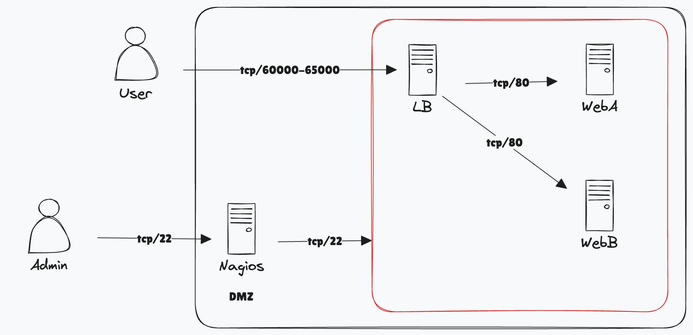
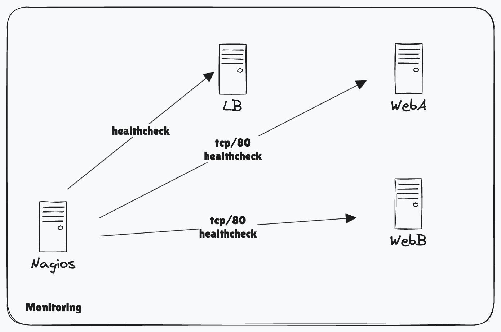

# Remote Infrastructure Challenge

## Network



## Monitoring



## Web App

### Dependencies

- Rust and Cargo: https://doc.rust-lang.org/cargo/getting-started/installation.html

Note: These dependencies are only required if testing the app locally.

### Configure

a `.env` file inside the web_app directory:

```sh
INDEX_RESPONSE=b
PORT=80
```

or environment variable:

```sh
INDEX_RESPONSE=b PORT=80 cargo run
```

### Try it locally

```sh
cd apps/web_app
cargo run
```

A web server will be running on the port you selected.  Visit `http://localhost:<port>` in a browser.

### Release

A new artifact will be released as code is pushed to main.  You can also manually produce a new artifact by running the Github Action "Build Web App Artifact" manually.

### Deploy

1. Place the web_app binary in /opt/web_app/web_app, with an associated .env file.  On web server B, make sure to change the environment variable to `INDEX_RESPONSE=b`.
2. Configure a systemd service file in /etc/systemd/system/web-app.service (see: [configs/systemd/webapp.service](configs/systemd/webapp.service))
3. Run the following:

```sh
# so the web app can run on ports lower than 1024 (port 80)
sudo setcap 'cap_net_bind_service=+ep' /opt/web_app/web_app

# start the service
sudo systemctl daemon-reload
sudo systemctl enable web-app
sudo systemctl start web-app
```

## Load Balancer

Details from: https://www.haproxy.com/blog/enable-sticky-sessions-in-haproxy

### Deploy

```sh
# 35.160.186.182
sudo apt-get update
sudo apt-get install -y haproxy
```

edit /etc/haproxy/haproxy.cfg with [configs/haproxy/haproxy.cfg](configs/haproxy/haproxy.cfg)

```sh
# validate it's correct
sudo haproxy -c -f /etc/haproxy/haproxy.cfg
# You should see: Configuration file is valid

# restart
sudo systemctl restart haproxy
```

